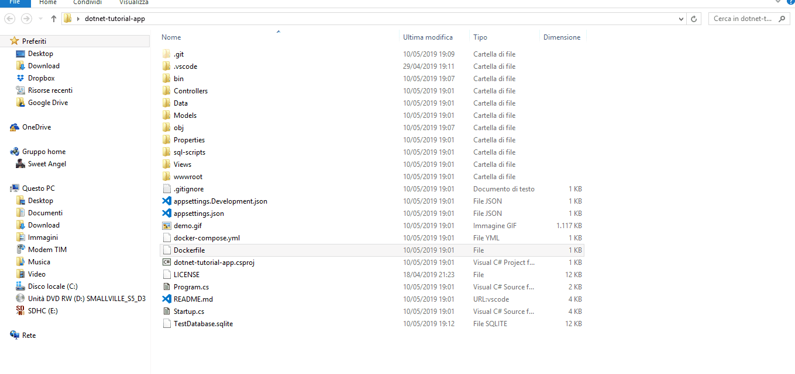

# dotnet-tutorial-app

> This is the code tutorial of a mvc app that connects to sqLite database for **CRUD** with **Entity Framework**.

## News

* [x] Create a docker compose with MySql in production
* [ ] Update demo gif

## Cli command

The app is been generated with ```dotnet new mvc``` command.

## Running Prerequisites

* [.NET Core SDK](https://www.microsoft.com/net/download/core).
* [Online sqlite client](https://sqliteonline.com/) (if you want to view database content)

## Development Prerequisites

1. Install [Visual Studio Code](https://code.visualstudio.com/).
2. Install the [C# extension](https://marketplace.visualstudio.com/items?itemName=ms-vscode.csharp) for Visual Studio Code. For more information about how to install extensions on Visual Studio Code, see [VS Code Extension Marketplace](https://code.visualstudio.com/docs/editor/extension-gallery).
3. Install [NuGet Package Manager](https://marketplace.visualstudio.com/items?itemName=jmrog.vscode-nuget-package-manager) from the Visual Studio Code Extension Marketplace.
4. Install [Sqlite client VSCode extension](https://github.com/AlexCovizzi/vscode-sqlite)

## Utilities guides

* [.NET core cli guide](https://docs.microsoft.com/it-it/dotnet/core/tools/?tabs=netcore2x)
* [.NET core MVC start with Entity Framework](https://docs.microsoft.com/it-it/aspnet/core/data/ef-mvc/intro?view=aspnetcore-2.2)
* [.NET core MVC example code](https://github.com/aspnet/AspNetCore.Docs/tree/master/aspnetcore/data/ef-mvc/intro/samples/cu-final)


## How to run

* Run ```dotnet run``` on your shell window in the git cloning folder of this repo

## How to build

### Generate dll multiplatform to run with SDK

* Run ```dotnet publish -c Release -r``` on your shell window in the git cloning folder of this repo
* Under **bin\Release\netcoreapp2.2\publish** there will be your dll app
* Run in that folder ```dotnet <app-name>.dll```, in this case ```dotnet dotnet-tutorial-app.dll```

### Docker container with dll multiplatform

Before you have to install on your machine [docker](https://docs.docker.com/docker-for-windows/install/) .

* Run ```docker build -t myapp .``` on your shell window in the git cloning folder of this repo
* After run ```docker run -it -p <YOUR-PORT>:80 --rm myapp``` 

> The docker build command creates an image with .NET SDK to generate published app, and a final app image (myapp) with only the runtime libraries for execution.

> The images are based on the alpine minimal linux distribution (round 90MB for Core, 170MB for ASP.NET).

> Replace YOUR-PORT with a enabled port of your machine. So you can access to the app in http://localhost:YOUR-PORT .

#### Docker Compose with MySql database

* Run ```docker-compose up``` on your shell window.

> You can use The ```-d``` option to run process in Daemon.

> The app will start on localhost:5000 (the port is specified in the **docker-compose.yml**).

* Run ```docker-compose down``` to stop and remove containers.

### Generate exe file

* Run ```dotnet publish -c Release -r win10-x64``` on your shell window
* Under **bin\Release\netcoreapp2.2\win10-x64\publish** there will be your exe app

The last exe file is a **distributable standalone app** executable without the .NET Core SDK.

## Demo


